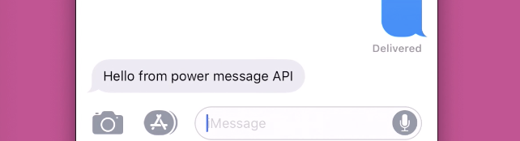

# Power Message

## What the `!#*?` is this?
Power Message is a simple two part program that allows you to safely control your iMessage account with a REST API. This program assumes you have a Message enabled Apple device and a phone number you'd like to text (that is not the phone number connected to the iMessage account)

The project goal is to break the blue text free! Apple does not provide any API for thier messaging service, and is not likely to happen soon (if ever).

So we propose a simple, owner controller, safe and easy way for a user to extend the capabilies of thier Apple computer and access their messages from anywhere in the world! 

It is important to note that we are not reverse engineering the iMessage API, we essentially provide Mac owners a convinent and secure way to remotely access thier computer and programmatically interact with iMessage. 

## Sounds cool, 😎 what can it do?

This beta supports a hanful of functionality:
1) Create/Read/Update/Delete user managment
2) JWT powered access control
3) Python client that can programatically access the API
4) realtime websocket message relaying from Apple device to secure server
5) ** Statistical analysis of emojis, and average response times 
6) ** Websocket connection to subscriber to incomming message in realtime

** means the core functionality is implemented but not documented.

## 🚴‍♀️ Get Going

First we start our server. This server will control our iMessage client, it allows us to send and recieve iMessages via a simple REST api. 

In this functional demo - both the server and client will be on the same machine, but if your interested in running the server in the cloud so you can access it from anywhere in the world 🌎 please shoot me an email!

First clone the repo - it contains the pre-compiled apps!
```bash
git clone https://github.com/drbh/power-message.git
cd power-message
```

Your gonna need to run 2 terminal windows and execute the following apps

## Relay and REST server
In the first terminal
```bash
./relay-server
```

Next we have to turn on our client. This client sends and recieves all of your iMessages. The client looks for the running server and makes a secure websocket connection via openssl generated 509 cert. 

Note: you will have to grant `Full Disk Access` to the `terminal` app since Apple has impelented a new security system that locks down Apple services like Mail, Safari and Messages. **If you do not grant the `terminal` access. power-message will not have permission to read the Messsage database - and the app will not work**

## Message Client
In the second terminal
```bash
./message-client
```

## 👨‍🚀 Sending Messages


An example username and password are hardcoded in the demo and you must login with these credentials to get a vaild JWT. We use JWT's to secure the REST api.

```python
pmc = PowerMessageClient(
    host = "http://localhost:8080/", 
    username = "power-message-user", 
    password = "super-secret-password"
)
```

Next we'll check if there are any existing users (since this is our first time, there will be no user so well need to add one!)

```python
pmc.get_all_users()
# {u'rows': []}
```

Lets add our own phone number **IMPORTANT THAT THIS IS NOT LINKED TO THE IMESSAGE ACCOUNT THAT YOUR COMPUTER IS SIGNED INTO**.

In my case - my laptop is logged into my `@icloud` account, and I added a user with my cellphone number (which is not associated with my icloud account).


```python
pmc.add_new_user({
    "name": "David Holtz",
    # "number": "+12345678910"
    "number": ". . . YOUR PHONE NUMBER INCLUDING COUNTRY CODE (eg +1). . .",
    "email": "david.richard.holtz@gmail.com",
    "profileurl": "",
    "instagram": "",
    "facebook": "",
    "linkedin": "",
    "firstname": "david",
    "lastname": "holtz",
})
```

We've succesfully added a new user, when interacting with the REST api we do not send message to RAW phone numbers. We add a user, then send messages to that user. 

In order to get the user id, we'll need to ask for a list of all of the existing users in power-message

```python
pmc.get_all_users()
# {u'rows': [{u'CreatedAt': u'2019-10-28T21:20:28.747819-04:00',
#    u'DeletedAt': None,
#    u'ID': 1,
#    u'UpdatedAt': u'2019-10-28T21:20:28.747819-04:00',
#    u'email': u'david.richard.holtz@gmail.com',
#    u'facebook': u'',
#    u'firstname': u'david',
#    u'instagram': u'',
#    u'lastname': u'holtz',
#    u'linkedin': u'',
#    u'name': u'David Holtz',
#    u'number': u'+12345678910',
#    u'profileurl': u''}]}
```

We can see that the user we just made has an ID of 1. We'll use this to send that user a message!


```python
pmc.send_message("1", "Send a iMessage via REST")
```


and then on the phone (whos phone number we set above)



🎉 yay, sending iMessages over REST is easy!

# 📝Notes

### keys 

Please generate your own keys!

The keys provided in the `keys` are for demonstration purposes only! I suggest using openssl to generate new keys - even for your demo app just to be secure.

### compilation

The two included libraries are binaries combiled for a MacBookPro

```bash
$ sw_vers
ProductName:	Mac OS X
ProductVersion:	10.14.5
BuildVersion:	18F132
```

OSX will always be the build target (since its the only hardware that can connect to Apple's Messages service.

### source code and the future

As of now this project is closed source but the binaries are freely available. In this inital release only the core functionality is accessible via the pre compiled binary - but I plan on adding some declaritive config files. This way people can easily deploy their relay servers in a cloud and use simple CLI tools to setup all the configurations.

Also - I'm not exactly sure whats next. Depending on the issues and responses from this inital release the future of the program will be based on what features help the maximum amount of users. 
